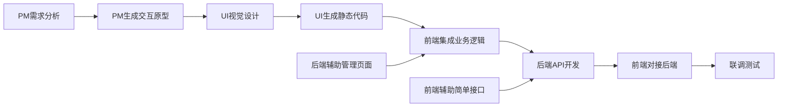

# AI Coding全栈开发转型方案

## 项目背景
在AI Coding时代，传统的前后端分离开发模式将被颠覆。通过Cursor + Claude 4.0 + MCP（Model Context Protocol）的加持，研发团队需要打破职能边界，实现真正的全栈开发能力。

## 核心工具栈
- **主要开发工具**：Cursor IDE
- **AI模型**：Claude 4.0 (claude-sonnet-4-20250514)
- **协议支持**：MCP (Model Context Protocol)
- **技术栈**：React + Antd + Java/Node.js + Spring + MySQL + Redis + ES + Kafka

## 第一阶段：前后端渐进式能力扩展

### 1.1 前端工程师向后端适度扩展

#### 核心职责保持：前端开发仍是主责
- **主要工作**：React组件开发、用户交互、前端架构设计
- **扩展目标**：具备简单后端接口开发和调试能力
- **扩展边界**：CRUD接口、简单业务逻辑、数据查询

#### MCP+Cursor基建能力建设

##### 1. API开发MCP工具链
```javascript
// 前端专用后端MCP配置
const frontendToBackendMCP = {
  // 只扩展简单接口开发
  apiScope: [
    "简单CRUD接口生成",
    "数据查询接口",
    "文件上传接口",
    "用户认证接口"
  ],
  
  // 技术栈选择：降低学习成本
  techStack: {
    runtime: "Node.js", // 前端熟悉的JavaScript
    framework: "Express.js", // 简单易学
    orm: "Prisma", // 类型安全，接近前端开发体验
    database: "PostgreSQL" // 保持与现有后端一致
  },
  
  // Cursor配置文件
  cursorrules: {
    role: "前端工程师扩展后端能力",
    codeStyle: "TypeScript + 详细注释",
    patterns: ["RESTful API", "统一错误处理", "参数验证"],
    limitations: ["复杂业务逻辑交给后端", "性能优化交给后端"]
  }
}
```

##### 2. 数据库操作MCP工具
```sql
-- 前端工程师只需掌握的SQL类型
-- 通过MCP自动生成，无需深入学习
CREATE TABLE users (
  id SERIAL PRIMARY KEY,
  name VARCHAR(100),
  email VARCHAR(100) UNIQUE,
  created_at TIMESTAMP DEFAULT NOW()
);

-- Cursor生成的查询语句
SELECT * FROM users WHERE email = $1;
INSERT INTO users (name, email) VALUES ($1, $2);
```

##### 3. 前端需要建设的基建能力

| 基建项目 | 建设内容 | MCP工具支持 | 学习成本 |
|----------|----------|-------------|----------|
| **API Mock工具** | 本地API服务快速搭建 | Express生成器 | 1周 |
| **数据库连接** | 简单的数据库操作 | Prisma代码生成 | 2周 |
| **接口调试** | 接口测试和调试能力 | Postman/Thunder集成 | 1周 |
| **部署流程** | 简单的服务部署 | Docker配置生成 | 1周 |
| **错误处理** | 统一的错误处理机制 | 错误处理模板 | 1周 |

### 1.2 后端工程师向前端适度扩展

#### 核心职责保持：后端架构和业务逻辑仍是主责
- **主要工作**：系统架构、复杂业务逻辑、性能优化、数据库设计
- **扩展目标**：具备简单前端页面开发和组件调试能力
- **扩展边界**：管理后台页面、数据展示组件、表单处理

#### MCP+Cursor基建能力建设

##### 1. 前端组件MCP工具链
```javascript
// 后端专用前端MCP配置
const backendToFrontendMCP = {
  // 只扩展管理类页面开发
  componentScope: [
    "数据表格组件",
    "表单组件",
    "图表展示组件",
    "管理后台页面"
  ],
  
  // 技术栈选择：基于现有React+Antd
  techStack: {
    framework: "React + TypeScript",
    uiLibrary: "Ant Design", // 减少CSS编写
    stateManagement: "简单的useState", // 避免复杂状态管理
    routing: "React Router"
  },
  
  // Cursor配置
  cursorrules: {
    role: "后端工程师扩展前端能力",
    focus: ["数据展示", "表单处理", "CRUD页面"],
    avoid: ["复杂动画", "用户交互设计", "前端架构设计"]
  }
}
```

##### 2. 后端需要建设的基建能力

| 基建项目 | 建设内容 | MCP工具支持 | 学习成本 |
|----------|----------|-------------|----------|
| **页面模板库** | 常用管理页面模板 | React组件生成器 | 2周 |
| **表单处理** | 基础表单验证和提交 | Antd Form集成 | 1周 |
| **数据展示** | 表格、图表展示组件 | 数据可视化生成 | 1周 |
| **接口对接** | 前端API调用封装 | Axios配置生成 | 1周 |
| **页面调试** | 前端调试和热更新 | 开发环境配置 | 1周 |

### 1.3 技术栈现状下的协作模式

#### 保持现有技术栈不变
```markdown
## 现有技术栈保持
- 前端：React + Antd + TypeScript
- 后端：Java + Spring + MySQL + Redis + ES + Kafka

## 扩展技术栈（渐进式）
- 前端扩展：Node.js + Express（简单接口）
- 后端扩展：React组件（管理页面）
```

#### 协作边界清晰划分

| 开发内容 | 主责角色 | 辅助角色 | 协作方式 |
|----------|----------|----------|----------|
| **用户端前端** | 前端工程师 | UI设计师 | 传统协作模式 |
| **管理端前端** | 前端工程师 | 后端工程师（辅助） | 后端写简单页面，前端优化 |
| **核心业务API** | 后端工程师 | - | 后端独立负责 |
| **简单CRUD接口** | 后端工程师 | 前端工程师（辅助） | 前端写原型，后端优化 |
| **数据库设计** | 后端工程师 | - | 后端独立负责 |
| **前端调试接口** | 前端工程师 | - | 前端独立使用MCP工具 |

#### Cursor + Claude 4.0 后端开发工具建设
```javascript
// Cursor配置文件 .cursorrules
const cursorBackendRules = {
  // Claude 4.0 MCP配置
  mcpServer: "claude-sonnet-4-20250514",
  codeStyle: "Clean Code + 中文注释",
  frameworks: ["Spring Boot", "Node.js/Express", "FastAPI"],
  
  // 后端代码生成规则
  apiGeneration: {
    pattern: "RESTful API + OpenAPI文档",
    errorHandling: "统一异常处理机制",
    validation: "参数校验 + 业务校验",
    logging: "结构化日志记录"
  },
  
  // 数据库操作
  dbOperations: {
    orm: "MyBatis/JPA + 自动生成CRUD",
    migration: "Flyway数据库版本管理",
    indexOptimization: "AI建议索引优化"
  },
  
  // MCP插件集成
  mcpPlugins: [
    "database-schema-generator",
    "api-documentation-generator", 
    "test-case-generator",
    "deployment-config-generator"
  ]
}
```

#### Cursor使用技巧
1. **项目初始化**：`Ctrl+K` → "创建Spring Boot项目，包含用户管理模块"
2. **API生成**：选中实体类 → `Ctrl+K` → "生成完整的CRUD接口"
3. **数据库设计**：`Ctrl+L` → 上传需求文档 → "生成数据库表结构和关系"
4. **错误处理**：`Ctrl+K` → "添加全局异常处理和参数校验"

#### 推荐学习路径
1. **Week 1-2**: AI辅助API设计与生成
2. **Week 3-4**: 数据库设计与ORM映射
3. **Week 5-6**: 业务逻辑层开发
4. **Week 7-8**: 部署与运维基础

### 1.2 后端工程师向前端拓展

#### 核心能力建设
- **组件化思维**：理解React组件生命周期和状态管理
- **UI框架应用**：熟练使用Ant Design进行快速原型开发
- **前端工程化**：掌握Webpack、Vite等构建工具的AI配置生成
- **用户体验优化**：学习前端性能优化和用户交互设计

#### Cursor + Claude 4.0 前端开发工具建设
```javascript
// Cursor前端配置文件
const cursorFrontendRules = {
  // 框架配置
  framework: "React 18 + TypeScript + Vite",
  uiLibrary: "Ant Design 5.x",
  stateManagement: "Zustand/Redux Toolkit",
  
  // 组件生成规则
  componentGeneration: {
    pattern: "函数式组件 + Hooks",
    styling: "CSS Modules + Tailwind CSS",
    props: "TypeScript接口定义",
    testing: "Jest + React Testing Library"
  },
  
  // Cursor快捷操作
  shortcuts: {
    "Ctrl+K": "生成组件/页面/工具函数",
    "Ctrl+L": "上传设计稿生成组件",
    "Ctrl+I": "行内代码优化建议",
    "Tab": "接受AI建议代码"
  },
  
  // MCP前端插件
  mcpPlugins: [
    "figma-to-react",
    "component-generator",
    "state-manager",
    "route-generator",
    "form-validator"
  ]
}
```

#### Cursor前端开发实践
1. **组件创建**：`Ctrl+K` → "创建用户列表组件，包含搜索、分页、操作按钮"
2. **样式优化**：选中组件 → `Ctrl+I` → "优化响应式布局和交互效果"
3. **状态管理**：`Ctrl+K` → "添加Zustand状态管理，处理用户数据"
4. **表单处理**：`Ctrl+K` → "创建表单组件，包含验证和提交逻辑"

### 1.3 项目架构重构

#### 新的工程架构（Cursor + Claude 4.0优化）
```
ai-fullstack-project/
├── .cursor/                  # Cursor配置目录
│   ├── .cursorrules         # Claude 4.0代码生成规则
│   ├── mcp-configs/         # MCP服务配置
│   └── prompt-templates/    # 常用提示词模板
├── ai-tools/                # AI辅助工具
│   ├── cursor-extensions/   # Cursor自定义插件
│   ├── claude-prompts/      # Claude 4.0专用提示词
│   └── workflow-automation/ # 自动化工作流
├── frontend/                # 前端项目
│   ├── src/
│   ├── .cursorrules        # 前端专用规则
│   └── ai-generated/       # AI生成组件标记
├── backend/                 # 后端项目
│   ├── src/
│   ├── .cursorrules        # 后端专用规则
│   └── ai-generated/       # AI生成代码标记
└── shared/                  # 共享资源
    ├── types/              # 前后端共享类型
    ├── cursor-configs/     # 共享Cursor配置
    └── mcp-schemas/        # MCP数据模式
```

### 1.4 推荐落地项目特征

#### 项目类型：智能内容管理系统
- **业务特点**：CRUD操作多，业务逻辑相对标准化
- **技术特点**：前后端分离，API设计规范
- **AI适用性**：大量重复性代码，适合AI生成
- **学习价值**：涵盖完整的全栈开发流程

#### 项目核心功能
1. 用户管理系统
2. 内容发布与审核
3. 数据统计与分析
4. 文件上传与处理
5. 权限控制系统

## 第二阶段：UI/PM向前端适度扩展

### 2.1 PM向前端扩展（保持产品核心职责）

#### 核心职责保持：产品规划和需求管理仍是主责
- **主要工作**：产品战略、需求分析、项目管理、数据分析
- **扩展目标**：具备简单原型开发和需求可视化能力
- **扩展边界**：交互原型、功能演示、需求验证

#### PM需要建设的基建能力

| 基建项目 | 建设内容 | MCP工具支持 | 学习成本 |
|----------|----------|-------------|----------|
| **原型生成器** | 交互原型快速生成 | 低代码平台集成 | 1周 |
| **需求可视化** | 需求转换为可交互demo | React组件生成 | 2周 |
| **数据展示** | 数据分析结果可视化 | 图表组件生成 | 1周 |
| **用户反馈收集** | 反馈表单和统计页面 | 表单生成器 | 1周 |

```javascript
// PM专用MCP配置
const pmToFrontendMCP = {
  // PM只需要原型和演示能力
  scope: [
    "交互原型生成",
    "功能演示页面",
    "数据可视化图表",
    "用户反馈收集表单"
  ],
  
  // 极简化的前端工具
  tools: {
    prototypeBuilder: "拖拽式组件生成",
    interactionDemo: "简单的页面跳转",
    dataVisualization: "现成图表组件库",
    formBuilder: "表单生成器"
  },
  
  // PM不需要学习的内容
  avoid: [
    "复杂的React开发",
    "CSS样式编写", 
    "状态管理",
    "前端工程化"
  ]
}
```

### 2.2 UI设计师向前端扩展（保持设计核心职责）

#### 核心职责保持：视觉设计和用户体验仍是主责
- **主要工作**：视觉设计、交互设计、设计系统维护
- **扩展目标**：设计稿直接生成可用代码
- **扩展边界**：静态页面、组件样式、设计系统代码化

#### UI设计师需要建设的基建能力

| 基建项目 | 建设内容 | MCP工具支持 | 学习成本 |
|----------|----------|-------------|----------|
| **设计转代码** | Figma到React组件 | Figma插件+代码生成 | 2周 |
| **样式系统** | Design Token代码化 | CSS变量生成器 | 1周 |
| **组件库维护** | 组件代码同步更新 | 组件文档生成 | 1周 |
| **交互效果** | CSS动画和过渡效果 | 动画代码生成 | 2周 |

```javascript
// UI设计师专用MCP配置
const uiToFrontendMCP = {
  // UI设计师专注设计到代码转换
  scope: [
    "静态页面HTML/CSS生成",
    "React组件样式生成",
    "Design Token代码化",
    "CSS动画效果生成"
  ],
  
  // 基于设计工具的代码生成
  workflow: {
    input: "Figma设计稿",
    process: "AI解析 + 代码生成",
    output: "React组件 + CSS样式",
    review: "前端工程师代码审查"
  },
  
  // UI设计师不需要学习的内容
  avoid: [
    "JavaScript业务逻辑",
    "API接口调用",
    "状态管理",
    "前端工程配置"
  ]
}
```

### 2.3 新协作模式（保持原有职责分工）

#### 协作流程优化，职责边界清晰



#### 职责保持与适度扩展对比

| 角色 | 核心职责（不变） | 扩展能力（新增） | 协作方式 |
|------|------------------|------------------|----------|
| **PM** | 产品规划、需求管理 | 交互原型生成 | 原型交付给UI和前端 |
| **UI** | 视觉设计、用户体验 | 设计稿转代码 | 代码交付给前端集成 |
| **前端** | React开发、用户交互 | 简单接口开发 | 接口原型交付给后端优化 |
| **后端** | 架构设计、业务逻辑 | 管理页面开发 | 页面原型交付给前端优化 |

### 2.4 渐进式能力建设路径

#### 第一阶段（1-2个月）：工具熟悉
- **PM**：学习原型生成工具，熟悉基础交互
- **UI**：学习Figma到代码转换，理解基础HTML/CSS
- **前端**：学习Node.js基础，掌握简单API开发
- **后端**：学习React基础，掌握Antd组件使用

#### 第二阶段（2-4个月）：实践应用  
- **PM**：在小项目中使用原型工具验证需求
- **UI**：设计稿直接生成组件代码，前端集成
- **前端**：开发简单CRUD接口，后端审查优化
- **后端**：开发管理后台页面，前端优化交互

#### 第三阶段（4-6个月）：流程优化
- 建立代码审查机制
- 优化协作流程
- 提升代码质量
- 扩大应用范围

#### PM工具建设（基于Cursor + Claude 4.0）
```markdown
## PM专用Cursor配置
### .cursorrules for PM
- 角色定义：产品经理 + 需求分析师
- 输出格式：结构化PRD + 技术可行性分析
- 专业术语：产品、用户体验、业务流程

### Cursor使用场景
1. 需求分析：Ctrl+L 上传用户反馈 → "分析用户需求并生成功能清单"
2. PRD生成：Ctrl+K → "根据业务目标生成产品需求文档"
3. 原型设计：Ctrl+K → "生成页面流程图和交互原型描述"
4. 数据分析：Ctrl+L 上传用户数据 → "分析用户行为并给出产品优化建议"
```

#### PM工作内容变化对比

| 工作内容 | 传统模式 | AI增强模式 | 变化说明 |
|----------|----------|------------|----------|
| **需求调研** | 人工访谈、问卷调查 | AI辅助分析用户反馈 + 人工深度访谈 | 效率提升60%，重点转向深度洞察 |
| **需求分析** | 手工整理、分类需求 | Cursor+Claude自动分析分类 | 从执行者变为审核者和决策者 |
| **PRD撰写** | 手工编写文档 | AI生成初稿 + 人工精调 | 时间节省70%，专注于业务逻辑 |
| **原型设计** | 使用Axure/Figma手绘 | AI生成交互原型 + 人工优化 | 快速验证想法，迭代周期缩短 |
| **需求评审** | 组织会议讲解需求 | 共享AI生成的可视化需求 | 沟通效率提升，减少理解偏差 |
| **项目跟进** | 手工跟踪进度 | AI预测项目风险 + 自动化报告 | 从被动跟进变为主动风险控制 |
| **数据分析** | Excel手工分析 | Claude处理复杂数据分析 | 从数据整理变为洞察发现 |
| **竞品分析** | 手工收集整理 | AI抓取分析 + 人工判断 | 提升分析深度和广度 |

### 2.2 UI设计师职能扩展

#### 新增能力
- **设计到代码**：从设计稿直接生成前端组件代码
- **样式系统管理**：AI辅助的设计系统维护和更新
- **用户体验优化**：基于数据驱动的设计决策
- **多端适配**：一次设计，多端生成

#### UI设计师工具建设（基于Cursor + Claude 4.0）
```javascript
// UI设计师专用Cursor配置
const uiDesignerConfig = {
  // 设计到代码工作流
  designToCode: {
    input: "Figma链接 + 设计说明",
    cursorCommand: "Ctrl+L 上传设计稿 → 生成React组件代码",
    output: "完整的组件代码 + CSS样式 + Props接口"
  },
  
  // 设计系统管理
  designSystem: {
    tokenGeneration: "Ctrl+K → 生成Design Token配置",
    componentLibrary: "AI维护组件库一致性",
    documentationSync: "自动同步设计文档"
  },
  
  // 响应式设计
  responsiveDesign: {
    breakpoints: "AI生成多端适配代码",
    accessibility: "自动添加无障碍支持",
    performance: "CSS优化建议"
  }
}
```

#### UI设计师工作内容变化对比

| 工作内容 | 传统模式 | AI增强模式 | 变化说明 |
|----------|----------|------------|----------|
| **视觉设计** | Figma/Sketch手工设计 | AI辅助生成 + 人工精调创意 | 重点转向创意和用户体验设计 |
| **组件设计** | 手工绘制每个组件 | AI生成基础组件 + 设计师优化 | 效率提升80%，专注于交互细节 |
| **设计规范** | 手工维护设计系统 | AI自动检查一致性 | 从维护者变为规则制定者 |
| **切图标注** | 手工切图并标注 | Cursor直接生成代码 | 完全省略此环节 |
| **设计评审** | 静态稿评审 | 直接评审可交互代码 | 评审质量提升，减少理解误差 |
| **适配工作** | 多端手工适配设计 | AI生成响应式代码 | 一次设计，多端生成 |
| **组件文档** | 手写设计文档 | AI自动生成文档 | 文档始终保持最新状态 |
| **用户测试** | 静态原型测试 | 真实代码用户测试 | 测试结果更准确，反馈更直接 |

### 2.5 各角色工作内容变化（渐进式调整）

#### PM工作内容适度扩展

| 工作内容 | 传统模式 | 渐进式AI增强模式 | 职责变化说明 |
|----------|----------|------------------|-------------|
| **需求调研** | 人工访谈、问卷调查 | AI辅助分析 + 人工深度访谈 | 核心职责保持，AI提升效率 |
| **需求分析** | 手工整理、分类需求 | AI辅助分析 + PM决策判断 | PM仍是决策者，AI是工具 |
| **原型设计** | 使用Axure/墨刀 | **新增**：MCP生成交互原型 | 扩展能力：简单原型自主生成 |
| **需求评审** | PPT讲解 | 可交互原型演示 | 沟通方式升级，职责不变 |
| **项目跟进** | 人工跟踪 | AI辅助 + PM风险判断 | 核心职责保持，工具升级 |

#### UI设计师工作内容适度扩展

| 工作内容 | 传统模式 | 渐进式AI增强模式 | 职责变化说明 |
|----------|----------|------------------|-------------|
| **视觉设计** | Figma手工设计 | 设计创意仍需手工 + AI辅助细节 | 核心创意工作保持不变 |
| **组件设计** | 手工绘制 | 设计思路手工 + AI生成变体 | 设计决策仍是核心职责 |
| **代码输出** | 标注交付 | **新增**：直接生成React代码 | 扩展能力：设计到代码转换 |
| **设计系统** | 手工维护文档 | **新增**：代码化设计系统 | 扩展能力：系统代码维护 |
| **设计评审** | 静态稿评审 | 可交互代码评审 | 评审方式升级，职责不变 |

#### 前端工程师工作内容适度扩展

| 工作内容 | 传统模式 | 渐进式AI增强模式 | 职责变化说明 |
|----------|----------|------------------|-------------|
| **前端开发** | 手工编写代码 | AI辅助 + 复杂逻辑手工 | 核心技术职责保持 |
| **组件开发** | 完全手工开发 | UI提供代码 + 前端优化集成 | 获得UI协助，专注业务逻辑 |
| **接口对接** | 等待后端接口 | **新增**：自主开发简单接口 | 扩展能力：减少等待时间 |
| **调试能力** | 前端调试 | **新增**：简单后端调试 | 扩展能力：全链路调试 |
| **前端架构** | 独立设计 | 仍是核心职责，AI辅助实现 | 核心职责保持，实现效率提升 |

#### 后端工程师工作内容适度扩展

| 工作内容 | 传统模式 | 渐进式AI增强模式 | 职责变化说明 |
|----------|----------|------------------|-------------|
| **系统架构** | 独立设计 | 核心职责保持，AI辅助实现 | 架构决策仍是核心能力 |
| **业务逻辑** | 手工编写 | 复杂逻辑手工 + AI辅助简单逻辑 | 核心业务仍需人工设计 |
| **API开发** | 完全手工 | AI辅助 + 前端协助简单接口 | 获得前端协助，专注复杂接口 |
| **管理页面** | 不涉及 | **新增**：简单管理页面开发 | 扩展能力：减少前端依赖 |
| **性能优化** | 独立负责 | 仍是核心职责，AI提供建议 | 核心职责保持，决策效率提升 |

### 2.6 能力扩展的边界控制

#### 扩展能力的限制范围

| 角色 | 可以扩展的能力 | 不应扩展的能力 | 原因 |
|------|----------------|----------------|------|
| **PM** | 简单原型生成、数据可视化 | 复杂前端开发、技术架构 | 保持产品专业性，避免技术复杂度 |
| **UI** | 静态代码生成、样式系统 | 业务逻辑、后端开发 | 保持设计专业性，避免逻辑复杂度 |
| **前端** | 简单CRUD接口、数据库查询 | 复杂业务逻辑、系统架构 | 避免后端专业领域，保持协作边界 |
| **后端** | 管理页面、数据展示 | 用户交互设计、前端架构 | 避免前端专业领域，保持协作边界 |

#### 质量保障机制

```markdown
## 代码审查机制
1. **扩展能力代码必须审查**
   - 前端写的后端代码 → 后端工程师审查
   - 后端写的前端代码 → 前端工程师审查
   - UI生成的代码 → 前端工程师审查
   - PM生成的原型 → UI设计师审查

2. **核心职责代码保持原有流程**
   - 前端核心代码 → 前端团队自主
   - 后端核心代码 → 后端团队自主
   - 设计核心工作 → 设计团队自主

3. **MCP工具使用规范**
   - 生成代码必须添加标识
   - 定期工具效果评估
   - 持续优化生成规则
```

## 第三阶段：业务项目推广策略

### 3.1 推广路径

#### 阶段一：试点项目（1-2个月）
- **选择标准**：业务逻辑简单、技术栈标准化
- **推荐项目类型**：
  - 内部工具系统
  - 数据展示Dashboard
  - 简单的CRUD应用

#### 阶段二：核心业务项目（3-6个月）
- **选择标准**：中等复杂度、有一定业务价值
- **推荐项目类型**：
  - 用户管理系统
  - 内容管理平台
  - 简单电商系统

#### 阶段三：复杂业务项目（6个月以上）
- **选择标准**：高复杂度、核心业务系统
- **推荐项目类型**：
  - 金融交易系统
  - 大数据分析平台
  - 企业级SaaS产品

### 3.2 团队能力建设计划

#### 培训体系
```markdown
## AI Coding能力培训大纲

### 第一模块：Cursor + Claude 4.0 基础使用（1周）
- Cursor IDE安装和配置
- Claude 4.0 (claude-sonnet-4-20250514) 模型调用
- .cursorrules 配置文件编写
- 基础快捷键和命令使用
- MCP协议集成配置

### 第二模块：AI辅助代码生成（2周）
- 前端组件快速生成技巧
- 后端API自动化生成
- 数据库设计AI辅助
- 测试用例AI生成
- 代码优化和重构

### 第三模块：全栈开发实践（4周）
- 前端工程师后端开发训练（Cursor + Spring Boot）
- 后端工程师前端开发训练（Cursor + React）
- 项目实践与代码审查
- AI生成代码质量控制

### 第四模块：新流程适应和团队协作（1周）
- AI增强研发流程适应
- 跨职能协作新模式
- 质量保障和风险控制
- 持续改进机制建立
```

### 3.3 质量保障体系

#### 代码质量控制
1. **AI生成代码审查机制**
   - 自动化代码质量检测
   - 人工审查关键业务逻辑
   - 版本控制与回滚机制

2. **测试策略调整**
   - 增加集成测试比重
   - AI辅助测试用例生成
   - 自动化测试覆盖率提升

3. **安全性保障**
   - AI生成代码安全扫描
   - 敏感数据处理规范
   - 权限控制标准化

### 3.4 成功指标定义

#### 效率指标
- 开发周期缩短65%以上（7-11周 → 3-4周）
- 代码生成效率提升300%（Cursor辅助）
- 跨职能协作效率提升50%
- 团队满意度调查≥8.5分

#### 质量指标
- AI生成代码质量评分≥85分
- Bug密度降低40%（AI辅助测试）
- 代码审查通过率≥90%
- 技术债务减少30%

#### 能力指标
- Cursor + Claude 4.0 熟练度≥90%
- 全栈开发能力覆盖率≥80%
- AI工具使用效率提升200%
- 新技术学习速度提升150%

## 实施建议

### 风险控制
1. **技术风险**：建立AI生成代码的质量评估标准
2. **人员风险**：制定详细的培训计划和能力转型路径
3. **业务风险**：从非核心项目开始试点，逐步扩展

### 成功关键因素
1. **管理层支持**：获得足够的资源投入和时间保障
2. **团队意愿**：充分沟通变革必要性，激发学习动力
3. **工具选择**：选择合适的AI工具和MCP平台
4. **循序渐进**：按阶段推进，及时调整策略

这个转型方案将帮助团队在AI时代重新定义研发流程，实现更高效的全栈开发能力。关键在于循序渐进的实施和持续的能力建设。
